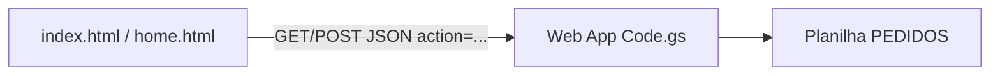

# Sistema de pedidos — Adonay Confecção

Front-end estático em HTML/CSS/JS que persiste dados numa planilha Google via Web App (Google Apps Script). Não há backend próprio nem etapa de build; o deploy típico é hospedar os arquivos estáticos e manter o Apps Script implantado.

## Propósito

Aplicação para **cadastro e acompanhamento de pedidos** de confecção: cliente, datas, produtos (tipo de peça, malha, estampas, tamanhos), valores (total, entrada, restante), status operacional e flags de produção (ARTE, OS, CORTE, etc.).

- **Fila visual** — [home.html](home.html): lista pedidos em aberto com indicadores (KPIs).
- **Formulário principal** — [index.html](index.html): criação e edição de pedidos.

## Stack e arquitetura

| Camada        | Tecnologia |
|---------------|------------|
| UI            | HTML5, CSS ([styles.css](styles.css), [print.css](print.css)) |
| Lógica cliente| JavaScript (`script.js`, `home.js`, [utils.js](utils.js)) |
| Config        | [config.js](config.js) — objeto global `CONFIG` (URL do Apps Script, empresa, listas de produtos, status, mensagens) |
| Backend / BD  | [Code.gs](Code.gs) no Google Apps Script + Google Sheets |

Fluxo resumido: o navegador envia requisições GET/POST com `action` e payload JSON para a Web App; o script grava/lê a aba `PEDIDOS`.

### Persistência e API

- **Planilha**: aba `PEDIDOS` com colunas desde dados básicos até JSON de produtos, financeiro, status, flags de produção, vendedor, tag e **ID busca** (4 dígitos). O servidor aceita layout de **26 ou 27 colunas**, conforme existência da coluna **COSTURA** no cabeçalho (ver `Code.gs`).
- **Endpoints** (`doGet` / `doPost`): ações como `salvarPedido`, `buscarPedido`, `listarPedidos` / `obterFila`, `obterDados`, `online`, `getStats`. Respostas em JSON.

## Arquivos principais

| Arquivo | Função |
|---------|--------|
| [index.html](index.html) | Formulário completo; `?id=` na URL para edição (lógica em `script.js`). |
| [home.html](home.html) | Dashboard da fila + tabela; usa `home.js`. |
| [editar-pedido.html](editar-pedido.html) | Redireciona para `index.html?id=...` (links antigos). |
| [script.js](script.js) | Estado (`estadoApp`), produtos dinâmicos, validação, chamadas à API, modo edição. |
| [utils.js](utils.js) | `Utils`: telefone, datas, IDs, formatação. |
| [Code.gs](Code.gs) | CRUD na planilha, migrações de cabeçalho, deduplicação na listagem por ID. |

## Desenvolvimento local

- [script-com-proxy.js](script-com-proxy.js) — variante que usa proxy em `http://localhost:8000/api/proxy` quando o site roda como `file://` ou em localhost, para contornar limitações de CORS; em produção usa `CONFIG.APPS_SCRIPT_URL` direto.

## Operação

1. Alterações em `Code.gs`: no projeto Google Apps Script, **Implantação** → nova versão → implantar.
2. Copiar a URL `/exec` da Web App para `APPS_SCRIPT_URL` em [config.js](config.js).
3. Publicar no host os arquivos estáticos alterados (`script.js`, `home.js`, `config.js`, `utils.js`, HTML, etc.).
4. Hard refresh no navegador. Na planilha, evitar linhas duplicadas com o mesmo ID de pedido.

## Limitações atuais

- Sem `package.json` / framework no front; sem suíte de testes automatizados no repositório.
- `obterDados()` no servidor pode devolver estruturas vazias para custos/localidades — o formulário usa principalmente listas definidas em `config.js`.
